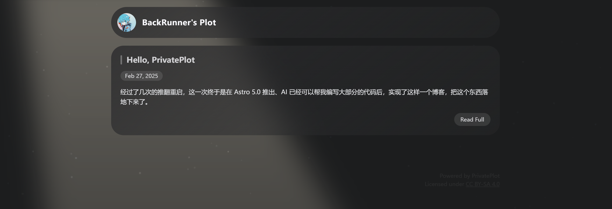

  <h1>PrivatePlot</h1>
  
Yet another Astro blog with highly customized styles runs on Cloudflare Pages.

## 🌏 Live Demo

[backrunner.blog](https://backrunner.blog)

## 🌌 Features

- Astro + React, flexible base framework for contents.
- Customized [Artalk](https://artalk.js.org/) intergrated, easy to setup a comment system
- Running on Cloudflare Pages.
- Based on SSR, no page generation.

## 📦 Deploy

> This project is built mainly for my personal usage, it will not accept feature requests about theme customization.

1. Modify the variables in `src/consts.ts`.
2. Create a D1 database on Cloudflare.
3. Copy `wrangler.toml.tmpl` as `wrangler.toml`, fill the database ids and internal auth token.
4. Run `npm run db:migrate:prod`, `npm run deploy` sequentially.

## 🧾 License

Apache 2.0
